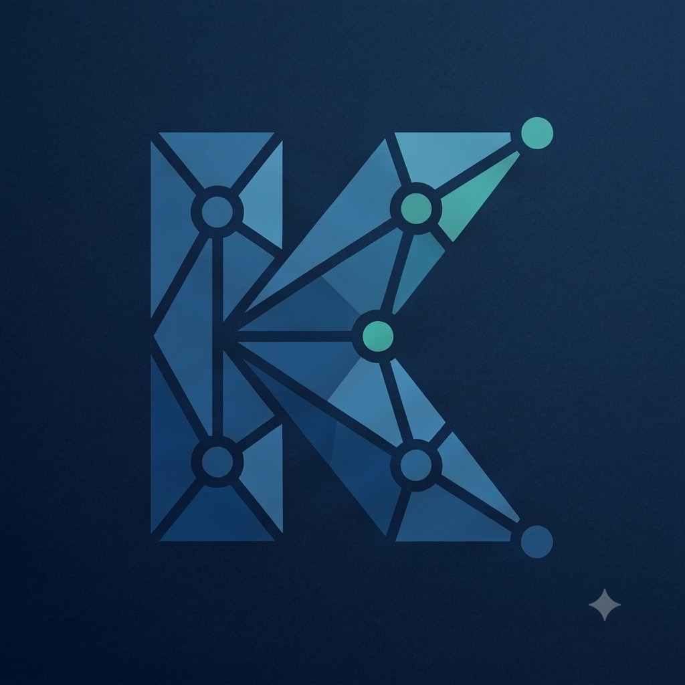

<div align="center">
  

  **KQL Assistant**

  Editing support for **Kusto Query Language (KQL)** on **Azure Monitor**, **Log Analytics**, **Microsoft Sentinel**, and related platforms.

  *Syntax validation · Schema-aware IntelliSense · Formatting · Quick fixes · Multi-query organization*
</div>

---

## At a glance

KQL Assistant is a **language support** extension: highlighting, diagnostics, completions, hover text, formatting, and lightweight project organization for `.kql` / `.kusto` files. It ships a large **offline** table/column catalog (700+ tables) so you get validation and suggestions without signing in to Azure.

**Validation is offline, not execution:** diagnostics use parser-backed query structure plus the bundled (or user-supplied) schema to catch many typos, scope mistakes, and structural issues. They do **not** prove a query will run in your workspace. Always run queries in Azure to confirm.

**Out of scope:** this extension **does not execute queries**. It does not connect to an Azure Data Explorer cluster or a Log Analytics workspace. Run queries in the Azure portal, Microsoft Sentinel, Fabric, or another tool that supports execution against your data plane.

## Features

**Editing and syntax**

- Syntax highlighting, bracket/quote behavior, comments, folding
- Real-time diagnostics (debounced while typing): brackets and strings, pipes, SQL-style patterns (`select` / `from`), table/column names against schema, multiline join keys, `let` table bindings, and query-block scope
- Information hints when column checks are limited (`lookup`)

**IntelliSense and schemas**

- Completions for 719+ bundled tables, operators, chart types, and 100+ functions
- Column suggestions (with type and description) from the same query scope used by diagnostics
- Optional **custom schema** via `kqlAssistant.userSchemaPath` for tenant-specific tables (merged over bundled data)
- Hover documentation for operators and functions; hover on **table names** and **column names** when the schema and context apply
- Signature help while typing function arguments

**Productivity**

- Format Document and Format Selection
- Code actions (lightbulb): typos, SQL-style fixes, brackets, missing `|`, ignore unknown tables
- Optional markdown headers (`# Category #`, `## Rule ##`) with folding, outline navigation, and **KQL: Select Current Query** / **KQL: Copy Current Query**
- Inline CodeLens on headers (copy/select, line counts) where supported

## Installation

### VS Code Marketplace (recommended)

1. Open the Extensions view (`Ctrl+Shift+X` / `Cmd+Shift+X`)
2. Search for **KQL Assistant**
3. Install

Or open the [Marketplace listing](https://marketplace.visualstudio.com/items?itemName=petstuk.kql-assistant).

### From source or VSIX

```bash
git clone https://github.com/petstuk/kql-assistant.git
cd kql-assistant
npm install
npm run compile
```

- **Development:** press `F5` in VS Code (Extension Development Host)
- **VSIX:** `npm run package` then  
  `code --install-extension kql-assistant-0.9.1.vsix`

## Quick start

1. Open or create a file with extension `.kql` or `.kusto`
2. Start from a table name, then chain operators with `|`
3. Use **Format Document** (`Shift+Alt+F`) and **KQL: Check Syntax** when you want a full offline validation pass (does not run against Azure)

## Organizing multiple queries

Use markdown-style headers so folds, outline, and CodeLens stay aligned:

- `# Category Name #` — group
- `## Rule or query name ##` — one query block

Example:

```kql
# Identity #

## Suspicious sign-ins ##

SigninLogs
| where ResultType != 0
| project TimeGenerated, UserPrincipalName, IPAddress

## Another rule ##

SigninLogs
| summarize c = count() by bin(TimeGenerated, 1h)
```

Fold arrows in the gutter collapse sections; use the **Outline** view to jump between blocks.

## Commands

| Command | Action |
|--------|--------|
| **KQL: Check Syntax** | Re-run offline diagnostics; message clarifies this is not execution validation |
| **KQL: Select Current Query** | Select the query section around the cursor (respects header boundaries) |
| **KQL: Copy Current Query** | Copy query body to the clipboard (without the header line / metadata comments) |
| **KQL: Export Analytics Rule YAML** | Open a Sentinel scheduled analytics-rule YAML stub for the current `## Rule ##` |

Open via **Command Palette** (`Ctrl+Shift+P` / `Cmd+Shift+P`).

Optional metadata under a rule header (shown in CodeLens / Outline):

```kql
## Suspicious sign-ins ##
// tactic: TA0006
// technique: T1110
// severity: Medium
// description: Failed sign-in burst

SigninLogs
| where TimeGenerated > ago(1h)
```

## Configuration

| Setting | Default | Description |
|--------|---------|-------------|
| `kqlAssistant.enableDiagnostics` | `true` | Turn syntax/schema diagnostics on or off |
| `kqlAssistant.diagnosticLevel` | `error` | `error`, `warning`, or `information` |
| `kqlAssistant.userSchemaPath` | *(empty)* | Optional JSON file with custom tables/columns (same shape as bundled `schemas/all-tables.json`); merged over bundled schemas |
| `kqlAssistant.ignoredTables` | `[]` | Table names to skip for unknown-table diagnostics (also set via lightbulb **Ignore unknown table**) |
| `kqlAssistant.lintMode` | `basic` | Detection/cost lint: `off`, `basic`, or `strict` (rules KQL101–KQL105) |
| `kqlAssistant.schemaPacks` | `["all"]` | Schema packs to load (`all`, `sentinel-core`, `mde`, `identity`, `asim`, `asim-parsers`) |

In Settings, search for **KQL Assistant**.

### CI / headless lint

After `npm run compile`:

```bash
npm run lint:kql -- examples --lint basic
node out/src/cli.js lint path/to/detections --format sarif --fail-on warning
```

## Snippets

There are **30+** snippets: type a prefix (e.g. `timerange`, `join`, `failedlogins`, `agg`) and press **Tab**. The full set is defined in [`snippets/kql.json`](snippets/kql.json) in this repository.

## Editor tips

- **Hover** operators, functions, tables, and columns (when context is known) for documentation
- **Lightbulb** fixes appear on diagnostics from KQL Assistant
- **Format Document** normalizes pipes, spacing, and commas (see also Format Selection for a range)

## Example queries

```kql
StormEvents
| where State == "TEXAS"
| project StartTime, EventType, DamageProperty
| take 10

StormEvents
| summarize EventCount = count(), TotalDamage = sum(DamageProperty) by State
| order by TotalDamage desc

StormEvents
| where StartTime >= ago(30d)
| extend Month = startofmonth(StartTime)
| summarize count() by Month, EventType
| render timechart
```

## Supported language surface (summary)

KQL is large; the extension focuses on common **keywords**, **tabular operators**, **aggregation** helpers (`count`, `sum`, `dcount`, `make_list`, …), and **scalar** functions (`ago`, `bin`, `parse_json`, `tostring`, …). Completions and hovers cover a substantial subset; see [KQL reference](https://learn.microsoft.com/en-us/kusto/query/) for the full language.

## Known limitations

- Validation is **offline parser-backed structure + schema** — not the Kusto compiler; a clean file does not guarantee the query runs in your environment
- Join validation covers common single-line and multiline `on` keys; complex join shapes are still partial
- Column checks remain limited for `lookup` (an information diagnostic is shown where checks are skipped)
- Heavy use of subqueries, `dynamic`, or macros may produce imperfect diagnostics
- Function parameter **types** are not deeply validated
- Schemas are not fetched from Azure automatically; use `kqlAssistant.userSchemaPath` for a local JSON export of custom tables

## Contributing

Issues and pull requests are welcome. See [CONTRIBUTING.md](CONTRIBUTING.md) for bug reports, feature ideas, and development setup.

## License

MIT — see [LICENSE](LICENSE).

## Acknowledgments

Built using Microsoft’s [KQL documentation](https://learn.microsoft.com/en-us/kusto/query/) and community practice for Log Analytics and Sentinel queries.

## Release notes (recent)

### 0.9.1

- New Marketplace icon; **Ignore unknown table** persistence; missing-pipe diagnostics; join-kind completions; `lookup` hover; activate only for KQL files; cleaner VSIX packaging.

### 0.9.0

- **Parser-backed query understanding**: diagnostics, completions, and hovers now share a QueryModel for query blocks, pipe steps, aliases, `let` table bindings, multiline join keys, `project-away`, and simple `mv-expand`.

### 0.8.3

- **Trust & scope**: Check Syntax and post-save feedback aligned with what the extension actually validates; optional `userSchemaPath` for custom tables; information diagnostics when column checks are limited; single-line join key validation; debounced live diagnostics; unit tests and CI.

### 0.8.2

- **Column validation fixes**: `project`-alias columns (e.g. `OfficeTime = TimeGenerated`) are no longer flagged as unknown. Columns from multi-line join subqueries (inner table columns plus any aliases projected inside the subquery) are now correctly recognised in downstream operators. Schema revert: five columns incorrectly added to `OfficeActivity` are removed.

### 0.8.1

- Documentation: clearer Marketplace README; full history in [CHANGELOG.md](CHANGELOG.md).

### 0.8.0

- Full-schema **table** completions; **schema-backed hover** for tables and columns; single shared schema load; **quick fix** alignment for SQL-style messages and bracket/`from` fixes.

### 0.7.3

- CodeLens line/rule counts on headers; redundant header hover removed.

Earlier versions: [CHANGELOG.md](CHANGELOG.md).
